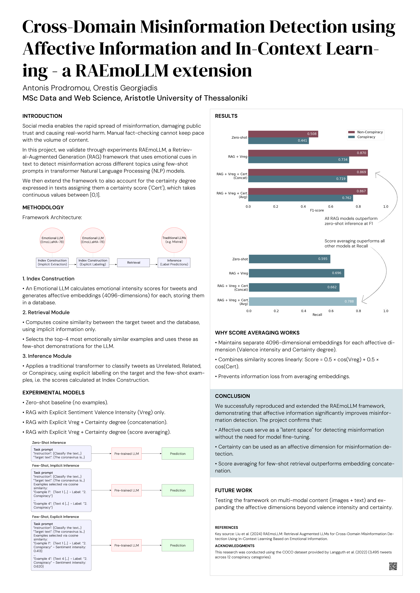

# An analysis of RAEmoLLM: a Cross-Domain Misinformation Detection methodology

## Project Summary
This project examines RAEmoLLM, a retrieval augmented (RAG) Large Language Model (LLM) framework to address cross-domain misinformation detection using in-context learning, based on affective information. We start by outlining traditional techniques and recent developments in Natural Language Processing with regards to misinformation, move to analysing the methodology and reproducing the RAEmoLLM model, while in the third part we present the results of an experiment conducted as a variation to the method.

---

## Research Poster
[](poster/RAEmoLLM%20poster%20-%20A0.pdf)
*Click the image above to view the full PDF version.*

---

## Original Research Reference
This work is based on the following research paper:

**RAEmoLLM: Retrieval Augmented LLMs for Cross-Domain Misinformation Detection Using In-Context Learning Based on Emotional Information** *Liu, Zhiwei; Yang, Kailai; Xie, Qianqian; de Kock, Christine; Ananiadou, Sophia; Hovy, Eduard (2025)* Proceedings of the 63rd Annual Meeting of the Association for Computational Linguistics (Volume 1: Long Papers).  
[http://dx.doi.org/10.18653/v1/2025.acl-long.806](http://dx.doi.org/10.18653/v1/2025.acl-long.806)

### BibTeX Citation
```bibtex
@inproceedings{Liu_2025,
   title={RAEmoLLM: Retrieval Augmented LLMs for Cross-Domain Misinformation Detection Using In-Context Learning Based on Emotional Information},
   url={[http://dx.doi.org/10.18653/v1/2025.acl-long.806](http://dx.doi.org/10.18653/v1/2025.acl-long.806)},
   DOI={10.18653/v1/2025.acl-long.806},
   booktitle={Proceedings of the 63rd Annual Meeting of the Association for Computational Linguistics (Volume 1: Long Papers)},
   publisher={Association for Computational Linguistics},
   author={Liu, Zhiwei and Yang, Kailai and Xie, Qianqian and de Kock, Christine and Ananiadou, Sophia and Hovy, Eduard},
   year={2025},
   pages={16508–16523} 
}